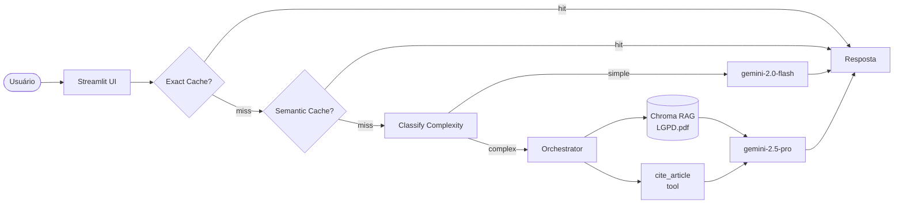

# LexAssist LGPD

> Assistente RAG especializado em LGPD para desenvolvedores e arquitetos de software: responde perguntas de compliance citando os artigos exatos da lei, reduzindo alucinações e acelerando decisões seguras sobre tratamento de dados.

<!-- GIF de demo: grave 10-15s mostrando uma pergunta sendo respondida com citação de fonte -->
<!--  -->

**Live demo:** <!-- substitua pelo link do Streamlit Cloud após deploy -->

---

## Problem statement

1. **Problema:** Devs e arquitetos perdem horas consultando o texto da LGPD para decisões corriqueiras ("posso armazenar esse dado?", "qual a base legal aqui?"). LLMs genéricos inventam artigos ou citam numerações erradas.
2. **Para quem:** Equipes de engenharia e produto que precisam de respostas rápidas e precisas sobre compliance de dados pessoais no Brasil.
3. **Por que LLM + RAG + Tool-use:** Busca simples retorna trechos sem contexto e sem síntese. RAG garante que a resposta seja ancorada no texto oficial da lei. Tool-use (`cite_article`) elimina alucinação de artigos: o LLM só cita numerações que existem no corpus verificado.

---

## Arquitetura



**Fluxo de uma query:**
1. Exact cache (SHA256) — captura replays idênticos sem custo
2. Semantic cache (cosine ≥ 0.93) — captura paráfrases com 1 embedding
3. Routing — queries curtas/factuais → `gemini-2.0-flash`; análises/comparações → `gemini-2.5-pro`
4. RAG — top-5 chunks da LGPD (Chroma local, chunk 800/100)
5. Tool-use — `cite_article(N)` para artigos solicitados explicitamente

Observação importante sobre embeddings / providers:
- O projeto suporta dois modos principais de embeddings:
    - OpenAI-compatible (via endpoint OpenAI-compat do Gemini quando aplicável) — usado historicamente como `embedding-1`/`embedding-1.0`.
    - Gemini nativo (`text-embedding-*`, ex: `text-embedding-004`) — exposto apenas pelo endpoint nativo do Google Generative AI.
- O pipeline detecta o modelo escolhido em `.env` e utiliza um wrapper que tenta o cliente OpenAI-compat primeiro e automaticamente faz fallback para o cliente nativo do Gemini quando o modelo não existir no endpoint OpenAI-compat (evita 404). Isso reduz erros de startup e facilita migrar entre modelos.

---

## Setup

```bash
# 1. Clone
git clone <seu-repo>
cd projeto-portfolio

# 2. Dependências
uv venv && source .venv/bin/activate
uv sync

# 3. API key
cp .env.example .env
# Edite .env com sua GEMINI_API_KEY ou OPENAI_API_KEY

# Variáveis relevantes no .env
# - GEMINI_API_KEY: chave do Google Gemini (se usar Gemini)
# - OPENAI_API_KEY: chave OpenAI (se preferir OpenAI)
# - EMBED_MODEL: modelo de embeddings (fallback, ex: gemini-embedding-001)
# - GEMINI_EMBED_MODEL: modelo de embeddings Gemini nativo (ex: text-embedding-004)

# Exemplo mínimo (Gemini):
# GEMINI_API_KEY=ya29.xxxxx
# GEMINI_EMBED_MODEL=gemini-embedding-001

# 4. Corpus (já incluso em data/corpus/Lgpd.pdf)
# Para adicionar mais documentos: copie PDFs para data/corpus/

# 5. Rodar local
streamlit run src/ui/streamlit_app.py

Notes:
- Se usar modelos Gemini nativos (`text-embedding-*`), instale o cliente Google correto (recomendado `google-genai`):
```bash
pip install google-genai
```
- O repositório também suporta um fallback local (Ollama) para embeddings quando não há API keys — útil para desenvolvimento offline. Configure e rode Ollama separadamente se precisar.
```

---

## Cost & Latency

> Preencher após rodar bench de 50 queries (veja notebook 05).

| Estratégia | Custo total | Redução | P95 latency |
|---|---:|---:|---:|
| Baseline (premium sempre) | $X.XX | — | XX ms |
| + Exact cache | $X.XX | XX% | XX ms |
| + Semantic cache | $X.XX | XX% | XX ms |
| **+ Routing cheap-first** | **$X.XX** | **XX%** | **XX ms** |

Meta da rubrica (banda "excelente"): **≥50% de redução** + P95 reportado.

---

## Design decisions

-- **Embedding selection & fallbacks** — o pipeline agora suporta e documenta 3 cenários:
    1. `GEMINI_EMBED_MODEL` aponta para um modelo Gemini nativo (ex: `text-embedding-004`) — o código usa o cliente nativo do Google Generative AI.
    2. `EMBED_MODEL` / OpenAI-compatible models (ex: `gemini-embedding-001`) — usa o endpoint OpenAI-compat do Gemini.
    3. Sem API keys — fallback local (`ollama`) para desenvolvimento.

    Para reduzir erros de startup, o pipeline valida a função de embeddings chamando a função (`embed_fn`) diretamente em vez de forçar uma chamada OpenAI-compat; também há um wrapper que faz fallback automático quando o endpoint OpenAI-compat retorna `404 model not found`.

- **`chunk_size=800, overlap=100`** — artigos da LGPD têm parágrafos médios de 300–600 chars. Chunks de 800 garantem que um artigo completo (com incisos) caiba em um único chunk, evitando respostas truncadas. Overlap de 100 preserva contexto entre artigos consecutivos.

- **`cite_article` como tool** — o LLM Gemini tende a inventar numerações de artigos quando responde de memória. A tool força o modelo a buscar o texto real antes de citar, zerando esse tipo de alucinação para os artigos cobertos (1, 2, 5, 6, 7, 8, 11, 14, 17, 18, 20, 46, 48, 52).

- **Routing por heurística, não por LLM** — usar outro LLM para classificar complexidade adicionaria latência e custo. Heurísticas (comprimento + keywords) são suficientes para separar lookups diretos de análises compostas, com latência < 1ms.

- **Sem re-ranking** — o corpus tem ~165 chunks (29 páginas). Com esse volume, top-5 por distância coseno já retorna chunks relevantes sem necessidade de re-ranker adicional.

---

## Limitations

- **Corpus fixo (29 páginas):** Cobre apenas o texto oficial da LGPD (Lei 13.709/2018). Perguntas sobre guias da ANPD, regulamentos setoriais ou jurisprudência retornam "Não encontrado no corpus".
- **Free tier Gemini (15 RPM):** Em uso simultâneo de múltiplos usuários, o app pode atingir rate limit. Para produção, use um plano pago ou adicione retry com backoff exponencial.

- **Rate limits & retries:** o processo de ingestão agora implementa retry com backoff exponencial e tenta respeitar informações de `retryDelay` retornadas pela API. Ainda assim, para grandes corpora considere usar embeddings locais (ex.: sentence-transformers) ou um plano com mais quota.
- **Tool `cite_article` cobre 14 artigos:** Artigos fora do cache da tool (ex: Art. 33 — transferência internacional) dependem exclusivamente do RAG, sem a proteção anti-alucinação extra da tool.

---

## Tech stack

- **LLM:** Gemini 2.0 Flash (cheap) / Gemini 2.5 Pro (premium)
- **Embeddings:** `gemini-embedding-001` (OpenAI-compat) ou Gemini nativo (`text-embedding-*`) — controlado via `GEMINI_EMBED_MODEL` / `EMBED_MODEL` em `.env`.
- **Vector store:** Chroma local (`data/chroma/`)
- **UI:** Streamlit
- **Observability:** structured logs JSON com `trace_id` (Langfuse opcional)
- **Deploy:** Streamlit Community Cloud

---

## Estrutura

```
projeto-portfolio/
├── data/
│   ├── corpus/
│   │   └── Lgpd.pdf          # texto oficial Lei 13.709/2018
│   └── chroma/               # vector store (gitignored)
├── src/
│   ├── ui/
│   │   └── streamlit_app.py  # interface principal
│   ├── pipeline/
│   │   ├── rag.py            # ingest, retrieve, answer + embedding wrapper, retries/backoff
│   │   ├── tools.py          # TODO 4: cite_article
│   │   ├── cache.py          # TODO 5: ExactCache + SemanticCache
│   │   └── routing.py        # TODO 6: classify_complexity
│   └── observability/
│       └── trace.py          # structured logging com trace_id
├── tests/
│   └── test_smoke.py         # smoke tests do pipeline
├── pyproject.toml
├── .env.example
└── README.md
```

---

## Os 6 TODOs — status

| TODO | Arquivo | Status |
|---|---|:---:|
| **1** | `rag.py::ingest_and_index` | ✅ (adicionado retry/backoff) |
| **2** | `rag.py::retrieve` | ✅ |
| **3** | `rag.py::answer` | ✅ (tratamento de cliente ausente) |
| **4** | `tools.py::cite_article` | ✅ |
| **5** | `cache.py::SemanticCache.get` | ✅ |
| **6** | `routing.py::classify_complexity` | ✅ |

---

## Rubrica

| Critério | Peso | Status |
|---|:-:|---|
| Técnica | 40% | TODOs 1-6 ✅ + erros tratados ✅ + logs estruturados ✅ |
| README | 30% | Problem ✅ + Arquitetura ✅ + Decisões ✅ + Limites ✅ |
| Custo | 20% | Cache ✅ + Routing ✅ — tabela de métricas pendente (pós-bench) |
| Demo | 10% | Deploy Streamlit Cloud (pós-entrega) |

---

*Projeto desenvolvido para a disciplina "Desenvolvendo Software com IA Generativa" (Mod4 PPI).*
